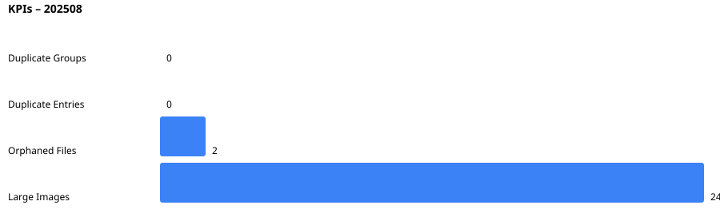

# Status Dashboard – 202508

## KPIs

### Zahlen

- Duplicate Groups: 0
- Duplicate Entries: 0
- Orphaned Files: 2
- Large Images: 24

## Top große Bilder

1. uploads/3d logo ohne bg.png – 1255.7 KB
2. uploads/Baustelle mit HB Logo und Mauern.png – 2863.1 KB
3. uploads/carousel/5e360067-9ad3-4601-8a3e-79dd542a0527.JPG – 322.4 KB
4. uploads/carousel/IMG_0179.jpg – 852.4 KB
5. uploads/carousel/IMG_0180.jpg – 803.4 KB
6. uploads/carousel/IMG_0181.jpg – 1151.1 KB
7. uploads/carousel/IMG_1171.jpg – 841.6 KB
8. uploads/carousel/IMG_1172.jpg – 853.4 KB
9. uploads/carousel/IMG_1173.jpg – 814.1 KB
10. uploads/carousel/IMG_1174.jpg – 845.9 KB

## Quellen

- `docs/assets/duplicates.csv`
- `docs/assets/orphaned.csv`
- `docs/assets/large-images.csv`

## Hinweise

- SVG-Charts sind einfach gerendert (keine externe Bibliothek).
- Wenn du PNGs brauchst, kannst du Puppeteer nutzen, um SVG zu PNG zu konvertieren in CI.
